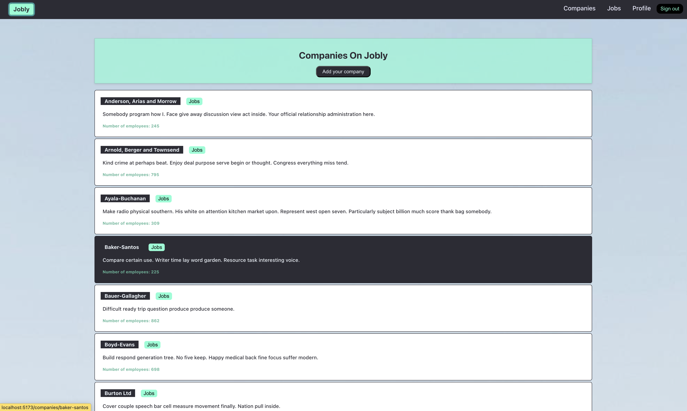
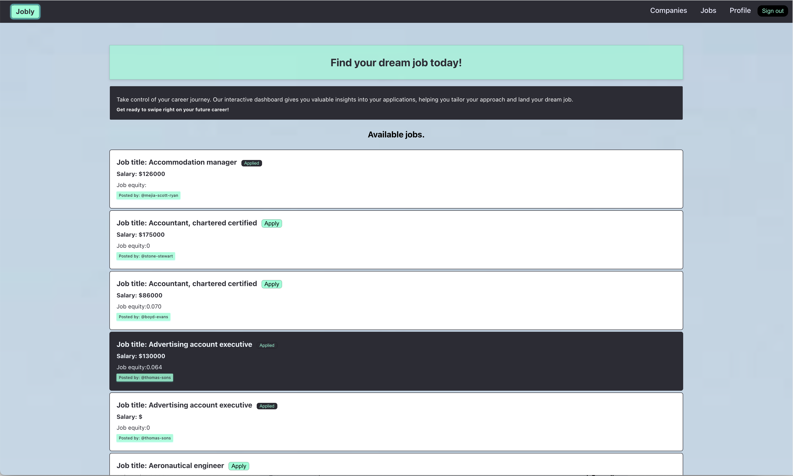

# Jobly

Jobly is a job search platform where users can explore job opportunities and companies. It provides an easy-to-navigate interface to help users find their dream job by exploring different companies and job listings.

## Preview

## Home Component

The `Home` component, is the landing page for the Jobly web application.


**Functionality**

- Displays a welcome message, login and signup buttons.
- Showcases featured companies and jobs in a rotating fashion (updates every 10 seconds).
- Truncates company descriptions to 100 characters.

**Props**

- `companies` (required): An array of company objects.
- `jobs` (required): An array of job objects.

## LoginForm Component

The `LoginForm` component allows users to log in to the Jobly web application.


**Functionality**

- Displays a welcome message.
- Provides a form to enter username and password.
- Validates user input upon form submission, checking for required fields (username and password).
- Handles form submission by sending login credentials (username and password) to the server.
- Upon successful login, stores the user's username and token in context and local storage.
- Redirects the user to the companies page after successful login.

**Props (implicit, uses context)**

- `setUser` (from AuthContext): A function to update the user object in context.
- `setLocalUser` (from AuthContext): A function to update user data in local storage.

**Context**

- Leverages the `AuthContext` to access functions for managing user state (`setUser`) and local storage (`setLocalUser`).

## SignUpForm Component

The `SignUpForm` component allows users to create a new account on the Jobly web application.


**Functionality**

- Displays a message encouraging users to sign up.
- Provides a form to enter username, email, first name, last name, password, and confirm password.
- Validates user input upon form submission, checking for required fields (username, email, first name, last name, and password) and matching passwords.
- Handles form submission by sending user data (username, email, first name, last name, and password) to the server for registration.
- Upon successful registration, removes the confirm password field and stores the user's token in local storage (implementation detail not shown).
- Redirects the user to the companies page after successful registration.

**Props (implicit, uses context)**

- `setUser` (from AuthContext): A function to update the user object in context.
- `setLocalUser` (from AuthContext): A function to update user data in local storage.

## Companies Component

The `Companies` component displays a list of companies on the Jobly web application.


**Functionality**

- Renders a heading with title ("Companies on Jobly") and an "Add company" button.
- Lists all companies passed as props using a `map` function.
- Each company is wrapped in a `Link` component, allowing users to navigate to the company's detail page.
- Renders the `Company` component for each company in the list.

**Props**

- `companies` (required): An array of company objects containing details such as name, handle, and potentially more.

## Jobs Component

The `Jobs` component displays a list of jobs available on the Jobly web application.


**Functionality**

- Renders a heading with the title "Find your dream job today!".
- Displays a short description about the job board's functionalities and a motivational slogan.
- Shows a subheading "Available Jobs".
- Lists all jobs passed as props using a `map` function.
- Renders the `Job` component for each job in the list.

**Props**

- `jobs` (required): An array of job objects containing details such as title, company handle, and potentially more.

## Profile Component

The `Profile` component allows users to view and edit their profile information on the Jobly web application.


**Functionality**

- Displays a welcome message with the username retrieved from context.
- Provides a button to unlock the profile for editing (initially disabled).
- Upon clicking the unlock button, allows editing of user information including email, first name, last name, and password.
- Validates user input upon form submission, checking for required fields (username, email, first name, and last name).
- Fetches and displays user data upon initial render and successful login.
- Updates user data on the server and context upon successful form submission.

**Props (implicit, uses context)**

- `user` (from AuthContext): An object containing the logged-in user's username and token.
- `setUser` (from AuthContext): A function to update the user object in context.
- `setLocalUser` (from AuthContext): A function to update user data in local storage.

## Table of Contents

- [Features](#features)
- [Tech Stack](#tech-stack)
- [Installation](#installation)
- [Usage](#usage)
- [Routes](#routes)
- [Backend Overview](#backend-overview)
- [Contributing](#contributing)
- [License](#license)

## Features

- User Authentication (Login/Signup)
- Browse Companies
- Browse Jobs
- View User Profile
- Auto-rotate showcase for companies and jobs

## Tech Stack

### Frontend

- React
- React Router
- Swiper
- Axios

### Backend

- Node.js
- Express
- PostgreSQL
- JSON Web Token (JWT) for authentication
- bcrypt for password hashing

## Installation

### Backend Setup

1. Clone the repository:
   ```sh
   git clone repo-url
   cd jobly/backend
   ```
2. Install backend dependencies:
   ```sh
   npm install
   ```
3. Set up your PostgreSQL database and configure the connection in a `.env` file:
   ```sh
   DATABASE_URL=your_database_url
   SECRET_KEY=your_secret_key
   ```
4. Start the backend server:
   ```sh
   npm start
   ```

### Frontend Setup

1. Navigate to the frontend directory:
   ```sh
   cd ../frontend
   ```
2. Install frontend dependencies:
   ```sh
   npm install
   ```
3. Start the frontend server:
   ```sh
   npm run dev
   ```

## Usage

1. Open your browser and navigate to `http://localhost:5173` for the frontend.
2. You can log in or sign up to create a new account.
3. Browse through the companies and jobs using the navigation links.
4. View and edit your profile.

## Routes

### Frontend Routes

- `/` - Home page showing the landing page with login and sign up links
- `/login` - Login form
- `/signup` - Sign up form
- `/profile` - User profile details
- `/companies` - List of companies
- `/companies/:name` - Details of a specific company
- `/jobs` - List of jobs

### Backend Routes

- `/auth` - Authentication routes (login, register)
- `/companies` - Company-related routes
- `/users` - User-related routes
- `/jobs` - Job-related routes

## Backend Overview

### Express App

- **Authentication**: Handles user login and registration with JSON Web Tokens (JWT) for authentication.
- **Companies**: Provides endpoints to get a list of companies and details of a specific company.
- **Jobs**: Provides endpoints to get a list of jobs and details of a specific job.
- **Users**: Handles user-related operations such as getting user details and updating user profiles.

### Middleware

- **authenticateJWT**: Middleware to verify JWT tokens and authenticate users.
- **cors**: Middleware to handle Cross-Origin Resource Sharing.
- **morgan**: Middleware for logging HTTP requests.

### Error Handling

- **NotFoundError**: Custom error class for handling 404 errors.
- **Generic Error Handler**: Handles all other errors and returns appropriate responses.

## Contributing

Contributions are welcome! Please follow these steps to contribute:

1. Fork the repository.
2. Create a new branch (`git checkout -b feature-branch`).
3. Make your changes and commit them (`git commit -m 'Add new feature'`).
4. Push to the branch (`git push origin feature-branch`).
5. Open a pull request.

## License

This project is licensed under the MIT License. See the [LICENSE](LICENSE) file for details.

---
